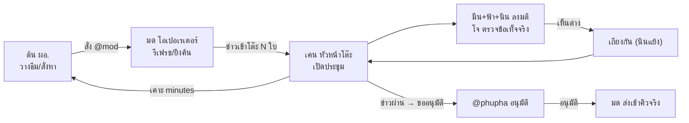

# 📰 แผนกโต๊ะข่าว (News Desk Dept) — Fable & Co.

> ทำงานคู่ระบบ **โต๊ะข่าวกลาง v2** (หาข่าวตามรอย → คัด → เช็ค → เคาะ → ส่ง)
> 🔴 แผนกนี้ = ชั้น "คน" ที่วางแผน+คุย+ตัดสินใจ ไม่แตะโค้ด/ท่อข่าวจริง | ยิงค้นจริง & ส่งข่าวจริง = @phupha อนุมัติก่อนเสมอ
> หลักการ: โมเดลถูกทำงานเยอะ แพงตัดสินอย่างเดียว | คุยกันสั้น กระชับ ประหยัด token แต่บันทึกครบ

## ทำเนียบ 7 คน (เรียงตามสายงาน)

| handle | ชื่อ | หน้าที่ (จับกับงานโต๊ะข่าว v2) | โมเดล | effort |
|---|---|---|---|---|
| @ton | ต้น | **ผอ.ข่าว** — วางธีมล่าวันนี้ สั่งทีมออกหาข่าว ตัดสินทิศทาง คุมภาพรวม | Sonnet 5 | medium |
| @mod | มด | **โอเปอเรเตอร์** — สั่งรีเฟรช/ยิงค้นตามธีม มอนิเตอร์รอบล่า ดึงข่าวเข้าโต๊ะ | Haiku 4.5 | low |
| @ken | เคน | **หัวหน้าโต๊ะ/บก.ใหญ่** — เปิดประชุม รวมมติ เคาะสุดท้าย | Sonnet 5 | medium |
| @nin | นิน | นักคัดข่าว — เสนอ/เถียงว่าข่าวไหนน่าส่ง ดี/ไม่ดี ไวรัลไหม | Sonnet 5 | low-medium |
| @meen | มีน | คนเช็คเนื้อ — จับข่าว "เนื้อน้อย/ผอม" เตือนก่อนส่ง | Haiku 4.5 | low |
| @fah | ฟ้า | คนดูโทน/สมดุล — จับ "แง่ลบเกิน" ดันมุมบวก/ช่วยเหลือ | Haiku 4.5 | low |
| @jo | โจ | ตรวจข้อเท็จจริงอิสระ — cross-check ก่อนเคาะ | GPT-5.6-Sol | high |
| @rin | ริน | **ผู้ตรวจการ/เก็บคลัง** — ตามผลงานจริงจากระบบ (สำเร็จ/ล้มเหลว) ลงคลังประวัติ · พบปัญหารายงาน @arch ทีมวิศวะ | Haiku 4.5 | low |

หนุนหลัง: **@oat (Opus)** เรียกเฉพาะ deadlock (เถียงไม่จบ/ทิศทางชนกัน) · **@phupha (Fable, CEO)** อนุมัติก่อน "ยิงค้นจริง" และ "ส่งข่าวจริง" ทุกครั้ง

## 🔄 วงจรทำงานทั้งแผนก (department cycle)

ขั้นเป็นคำ: **ต้น**วางธีม → สั่ง **มด**รีเฟรช/ยิงค้น → มดดึงข่าวเข้าโต๊ะแจ้ง **เคน** → เคนเปิดประชุม **มีน/ฟ้า/นิน**ลงมติ + **โจ**ตรวจ → เห็นต่างก็เถียง → **เคน**เคาะเขียน minutes รายงานกลับ **ต้น** → ข่าวผ่านขออนุมัติ **@phupha** → อนุมัติแล้ว **มด**ส่งเข้าคิวจริง

## เกณฑ์ตัดสินข่าว (ทุกคนยึดร่วมกัน)
- ✅ ส่ง = เนื้อแน่นพอเขียนได้ + มีมุมน่าสนใจ/ไวรัล + โทนสมดุล
- ⚠️ ต้องคุย = เนื้อน้อย (มีน) / แง่ลบเกิน (ฟ้า) / ข้อเท็จจริงคลุมเครือ (โจ) / นอกธีม (ต้น)
- ❌ ตก = เนื้อผอมกู้ไม่ได้ / ลบล้วนไม่มีมุมบวก / ข้อมูลผิด

## กติกาสื่อสาร (ประหยัด token สูงสุด — แต่คุยกันจริงทั้งแผนก)
1. **ช่องสื่อสารหลัก = `comm-log.md`** — ทุกคนเขียนได้ รูปแบบ `[n] @ผู้รับ: ...` ≤2 บรรทัด (สั่งงาน/แจ้ง/ถาม/ตอบ)
2. **ลงมติข่าว = `meeting/board.md`** — `[@handle] ข่าว#N: ✅/⚠️/❌ เหตุผล≤12 คำ` (1 ข่าว 1 บรรทัดต่อคน)
3. **เถียงกัน = rebuttal ≤2 บรรทัด/คน** เฉพาะข่าวที่เห็นต่าง (ข่าวที่ทุกคน ✅ ไม่ต้องคุย)
4. **เคาะ = `meeting/minutes.md`** (เคนเขียนคนเดียว): `ข่าว#N → ส่ง/ตก/แก้ก่อน + เหตุผล 1 บรรทัด`
5. พูดเหมือนคนโต๊ะข่าวจริง สั้น ตรง มีชีวิต ห้ามเรียงความ · UTF-8 · โต๊ะใครโต๊ะมัน · อ้าง path แทนแปะเนื้อ

## 🔴 กติกาบันทึก (บังคับทุกคน — ไม่มีข้อยกเว้น)
ทุก**การกระทำ** (ส่งข่าว/ยิงค้น/แก้ไฟล์) · ทุก**การสื่อสาร** (สั่งงาน/ถาม/ตอบ/รายงาน) · ทุก**การตัดสินใจ** (มติ/เคาะ/เหตุผล) **ต้องมีบันทึกเป็นไฟล์เสมอ** — งานที่ไม่มีบันทึก = ถือว่าไม่ได้ทำ. ผลลัพธ์ทุกงานทั้ง**สำเร็จและล้มเหลว**ต้องลงคลังพร้อมสาเหตุ ตรวจย้อนหลังได้หมด

## 📚 คลังประวัติงาน (job archive)
- `archive/jobs.md` — สมุดคลังงาน 1 งาน 1 บรรทัด: `| วันที่ | งาน/lead | ผล ✅/❌/⏳ | jobId/สาเหตุ | อ้างอิง |` (ริน เขียนหลัก, มด เขียนตอนส่ง)
- ริน ตามเช็คผลจริงจากระบบ (คิวเขียน/สถานะ job) แล้วอัปเดตคลัง — ผู้ใช้เปิดดูจากจอแผนกได้เลย
- งานล้มเหลว → ริน เขียนรายงานปัญหาลง `departments/engineering/comm-log.md` แท็ก @arch (ทีมวิศวะรับไปวินิจฉัยต่อ) + บันทึกใน comm-log แผนกด้วย

## บันทึก (เก็บครบ แต่บรรทัดเดียวจบ)
- `comm-log.md` — สื่อสารข้ามคนทั้งแผนก (ใครก็เขียน)
- `meeting/board.md` — กระดานลงมติต่อข่าว (ทีมคัดเขียน)
- `meeting/minutes.md` — มติที่เคาะ (เคนเขียน)
- `worklog.md` — สมุดงานแผนก (เคน/ต้นจด `- [วันที่/รอบ #n] เหตุการณ์`)
- `runs/<id>.md` — สรุปแต่ละรอบล่า/ประชุม

## Workflow
- **วางแผนล่า**: `.claude/workflows/newsdesk-hunt.js` — ต้น (ผอ.) วางธีม+คีย์เวิร์ด → brief ให้ @mod (ยิงค้นจริงรอ @phupha อนุมัติ)
- **ประชุมคัดข่าว**: `.claude/workflows/newsdesk-meeting.js` — รับ `{candidates, runId}` → ลงมติขนาน → เถียง → เคนเคาะ → minutes
- **เชื่อมระบบจริง**: `.claude/workflows/newsdesk-bridge.js` — อ่านลีดจริง `GET /api/desk/research/leads` → ประชุม (nested) → แนะนำ; **ส่งจริงล็อก**: ต้องรันซ้ำด้วย `{sendIds:[leadId,...]}` ที่ @phupha อนุมัติ → `POST /api/desk/research/extract {action:'extractAndSend'}`
- ผล verdict=send ต้อง @phupha อนุมัติก่อนเข้าคิวจริง (ห้าม auto — กฎบริษัท + มีค่า LLM/เผยแพร่จริง)
